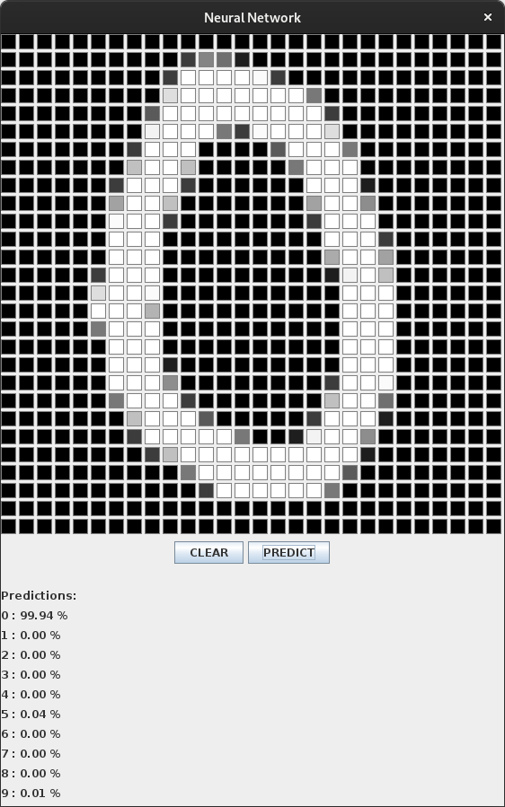
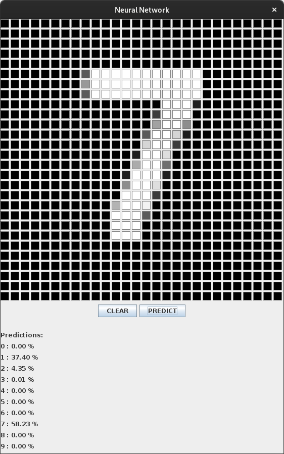
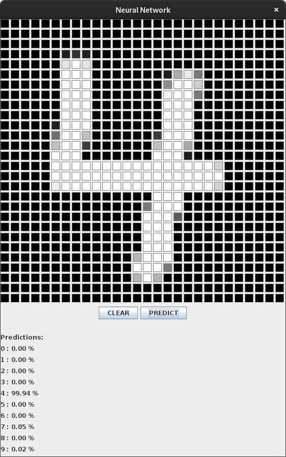
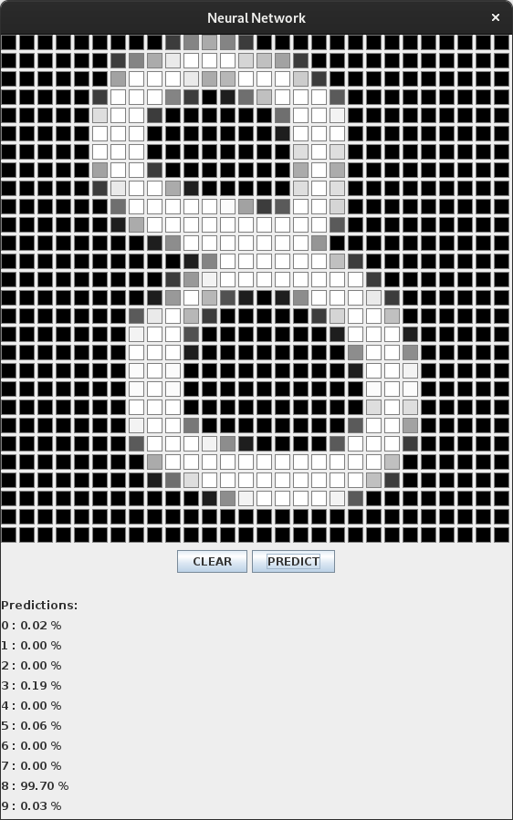

# Project Neural Network

This is a basic implementation of a simple Artificial Neural Network that uses the MNIST Dataset to classify handwritten digits on a 28 by 28 pixels canvas.

### Working

The Source Code exists in the `Neural-Network/` directory.
#### `neuralnetwork` package
 - The `neuralnetwork` package contains the code for the Neural Network structure.
 - `CSVHandler` class is used to read and write data to and from .`csv` files.
 - `Neuron` class is the basic block of our Neural Network.
 - `Layer` class basically stores objects of `Neuron` class. This class is further inherited by `HiddenLayer` and `OutputLayer` classes for having different activation functions.
 - `Network` class is where all the bits and pieces of our Neural Network come together. This is where Training and Testing of the Network takes place.
#### `guitester` package
 - `guitester` package contains the code for the GUI to test the model by hand-drawing the digits.
 - `DrawingBoard` is the Drawing Board used in the `Main` application file to draw and predict the digits using the model.

### How to use

Clone this repository
``` bash
git clone https://github.com/IshaqJunejo/project-neural-network.git
```

Go to the `Neural-Network` directory.
``` bash
cd project-neural-network/Neural-Network/
```

Compile the java files in both packages.
``` bash
javac -d . neuralnetwork/*.java
javac -d . guitester/*.java
```

Run the `Main.java` file in `guitester` package to try the pre-trained model.
``` bash
java guitester.Main
```

You can also run the `Network.java` file in `neuralnetwork` to train the model yourself.
``` bash
java neuralnetwork.Network
```

### Screenshots





Our model is a little confused in here, but it is still correct.





### Plans

 - [x] Achieving 90+ percent accuracy.
 - [x] Write weights and biases to `.csv` files.
 - [x] Expanding from `10 Neurons in 1 Hidden Layer` to `16 Neurons in 2 Hidden Layers each`.
 - [x] Having a GUI to hand-draw the digits for testing the Network.
 - [ ] Implement Data Augmentation for having better performance with noisy test cases.
 - [ ] Optimizing for Memory Consumption.

### Contributions

Any and every contribution you make to this project is more than welcome.

- Just fork this repository.
- Clone your fork.
- Make a new branch.
- Commit and push your changes.
- Open a pull request.

### License

This project is licensed under the MIT License - see the [LICENSE](LICENSE) file for details.